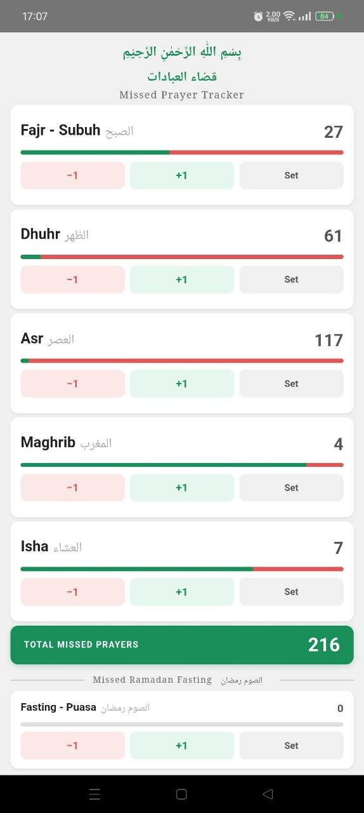

# 🕌 MissedPrayer / Qadha Outstanding — قضاء العبادات
A simple Android app to track missed (qadha) prayers and fasting.

---

## About
This app helps Muslims keep count of their outstanding obligatory prayers and missed fasting days. Clean, minimal, and straightforward to use.

---

## Features
- Tracks missed all 5 daily prayers — Fajr, Dhuhr, Asr, Maghrib, Isha
- Tracks missed fasting (Puasa) separately
- Progress bar shows remaining vs completed
- Set any number, then use +1 / −1 to update as you go
- Total missed prayers counter
- 100% offline — no internet needed

---

## Download APK
Not on Google Play Store. Download APK directly.

**To install:**
1. Download `MissedPrayer-Qadha.apk`
2. On your phone: **Settings → Security → Allow Unknown Sources**
3. Open the APK and tap Install

---

## Built With
- Android (Kotlin) + WebView
- UI built with HTML / CSS / JavaScript
- Fully offline — uses system Arabic fonts (Noto Naskh Arabic)
- Min SDK: API 21 (Android 5.0+)

---

## Screenshot

  

---

## License
Free for the Ummah to use and share.
