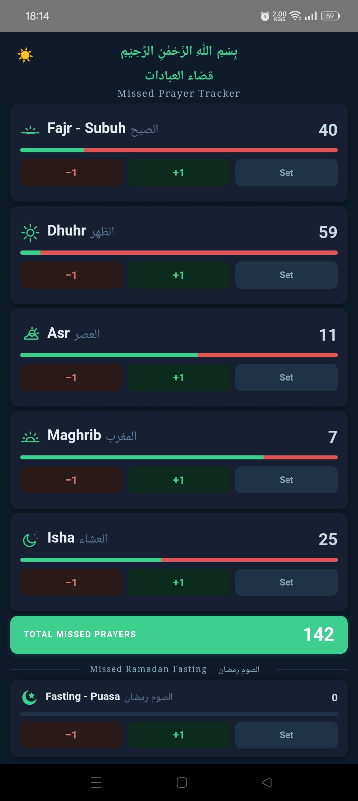
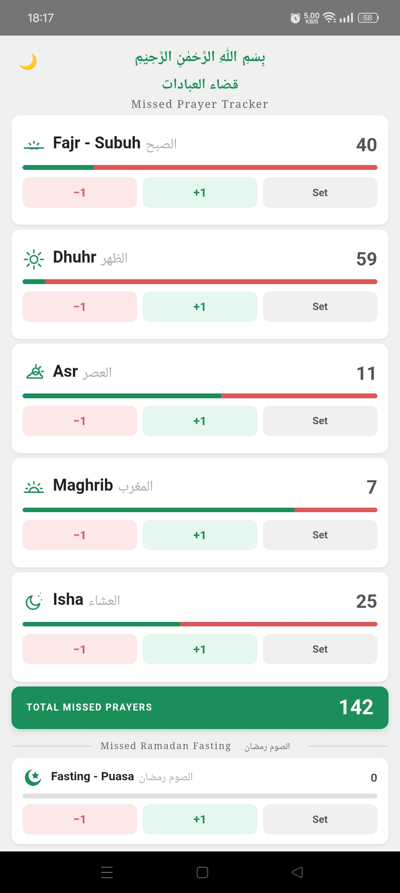

**To install:**
1. Download `MissedPrayer-Qadha.apk`
2. On your phone: **Settings → Security → Allow Unknown Sources**
3. Open the APK and tap Install

---

## Built With
- Android (Kotlin) + WebView
- UI built with HTML / CSS / JavaScript
- Fully offline — uses system Arabic fonts (Noto Naskh Arabic)
- Min SDK: API 21 (Android 5.0+)

---

## Screenshot

  
  

---

## License
Free for the Ummah to use and share.
